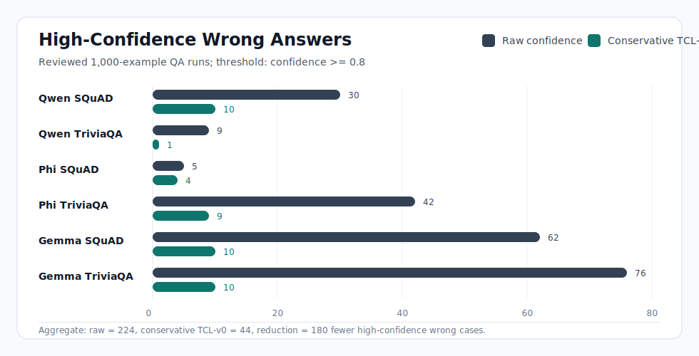

# Truth Calibration Layer (TCL)


Truth Calibration Layer is an independent research project on confidence-aware language models. The current repository combines a theory-stage TCL proposal with TCL-v0, an empirical diagnostic that probes whether frozen LLM hidden states contain signal about answer correctness.

Current status: **theory-stage framework plus reviewed TCL-v0 diagnostics**.

> **Scope warning:** TCL-v0 is not a general truth detector. In this repository, "truth calibration" currently means estimating whether a generated answer is likely correct in bounded QA benchmark settings. TCL-v0 does not verify open-ended factuality, solve hallucination, or provide deployment-ready reliability guarantees.

## Why This Matters

Many LLM failures are not only wrong answers, but wrong answers expressed with high confidence. TCL-v0 studies whether internal model representations can help detect that overconfidence better than raw generation confidence alone.

The narrow empirical question is:

```text
Can frozen LLM hidden states support better answer-correctness confidence than raw generation confidence and raw-only post-hoc calibration?
```

## Start Here

- Theory paper: `TCL-Theory-Paper-Theoretical-Framework.docx`
- Empirical writeup: `TCL-v0-research-writeup.md`
- Reviewed evidence report: `TCL-v0-evidence-report-v2.md`
- Raw-only baseline checkpoint: `TCL-v0-Baseline-Checkpoint.md`
- Reviewed answer-mean ablation checkpoint: `TCL-v0-Reviewed-AnswerMean-Ablation-Checkpoint.md`
- Full TCL gap analysis: `TCL-v0-to-Full-TCL-Gap.md`
- Next experiment plan: `TCL-v0-Ablation-Plan.md`
- Kaggle ablation protocol: `TCL-v0-Kaggle-Ablation-Runbook.md`
- Experiment code and records: `tcl_experiments/`

## Current Result Snapshot

As of the June 7, 2026 reviewed checkpoint, TCL-v0 has been tested across:

- models: `Qwen/Qwen2.5-0.5B-Instruct`, `microsoft/Phi-3.5-mini-instruct`, and Kaggle-hosted Gemma 2B-it
- benchmarks: SQuAD validation with context and TriviaQA `rc.nocontext`
- scale: six 1,000-example runs, with 200 held-out test examples per run
- review: targeted manual review completed for all six runs

The most consistent practical signal is reduction of high-confidence wrong answers under the conservative TCL-v0 score:

```text
conservative_confidence = min(raw_generation_confidence, hidden_state_probe_confidence)
```

| Reviewed run | Raw wrong >= 0.8 | Conservative TCL-v0 wrong >= 0.8 |
|---|---:|---:|
| Qwen SQuAD-1000 | 30 | 10 |
| Qwen TriviaQA-1000 | 9 | 1 |
| Phi SQuAD-1000 | 5 | 4 |
| Phi TriviaQA-1000 | 42 | 9 |
| Gemma SQuAD-1000 | 62 | 10 |
| Gemma TriviaQA-1000 | 76 | 10 |



Summary across these six reviewed runs:

```text
Raw high-confidence wrong answers:                 224
Conservative TCL-v0 high-confidence wrong answers: 44
Reduction:                                         180 fewer cases
```

After adding stronger raw-only calibration baselines, the interpretation becomes stricter:

- hidden-state conservative TCL-v0 has better Brier score in 5 of 6 reviewed runs
- hidden-state conservative TCL-v0 has better ECE in 4 of 6 reviewed runs
- hidden-state conservative TCL-v0 has better AUC in 5 of 6 reviewed runs
- raw-only calibration explains part of the high-confidence-error reduction
- Phi TriviaQA is a clear negative case where raw-only calibration is stronger

Current best-position statement:

```text
TCL remains a theory-stage framework. TCL-v0 provides reviewed preliminary evidence that frozen hidden states can support answer-correctness confidence calibration under tested QA settings, but it does not validate full TCL.
```

## What TCL-v0 Does

TCL-v0 leaves the base model frozen and records:

- question
- accepted answer
- model answer
- correctness label
- raw generation confidence
- hidden-state vector
- probe confidence

It compares raw confidence, hidden-state probe confidence, conservative fusion, and raw-only calibration baselines using:

- ECE and MCE
- Brier score
- reliability bins
- accuracy
- AUC where both classes are present
- high-confidence wrong-answer counts

## Current Supported Claims

- TCL is a theoretical framework and research hypothesis.
- TCL-v0 is an early confidence-only diagnostic around frozen models.
- Reviewed TCL-v0 diagnostics suggest hidden states contain useful calibration signal under tested QA settings.
- TCL-v0 provides empirical motivation for a future joint token-and-trust training objective.
- Conservative TCL-v0 is the strongest current diagnostic variant in this package.
- The most consistent practical signal is reduction of high-confidence wrong-answer counts.

## Claims Outside Current Evidence

This repository does not claim that:

- TCL is validated.
- TCL makes LLMs truthful.
- TCL solves hallucination.
- TCL-v0 is a general factuality, reasoning, safety, or value-judgment verifier.
- TCL-v0 generalizes beyond the tested models and datasets.
- The full four-dimensional TCL trust vector has been implemented.
- TCL-v0 is ready for deployment or user-facing reliability decisions.

## Distance From Full TCL

TCL-v0 tests one supporting assumption:

```text
frozen hidden states contain answer-correctness calibration signal
```

That assumption is necessary for the broader TCL theory to be plausible, but it is not sufficient to validate full TCL.

Full TCL would require at least:

- a model trained with a joint objective for next-token prediction and trust-score prediction
- an integrated trust head or architectural module, not only an external post-hoc probe
- multiple trust dimensions beyond answer correctness, such as reasoning validity, grounding/provenance, and epistemic uncertainty
- comparisons against raw confidence, raw-only post-hoc calibration, and frozen-probe baselines

## Repository Map

| Path | Purpose |
|---|---|
| `TCL-Theory-Paper-Theoretical-Framework.docx` | Canonical theory-stage paper |
| `TCL-v0-research-writeup.md` | Main empirical method/results writeup |
| `TCL-v0-evidence-report-v2.md` | Reviewed extended-validation evidence report |
| `TCL-v0-Baseline-Checkpoint.md` | Raw-only calibration baseline checkpoint |
| `TCL-v0-Reviewed-AnswerMean-Ablation-Checkpoint.md` | Local answer-mean feature ablation checkpoint |
| `TCL-v0-to-Full-TCL-Gap.md` | Explicit boundary between TCL-v0 and full TCL |
| `TCL-v0-Ablation-Plan.md` | Predeclared next ablation experiment |
| `TCL-v0-Kaggle-Ablation-Runbook.md` | Kaggle protocol for the next ablation checkpoint |
| `TCL-v0-Roadmap.md` | Research and engineering roadmap |
| `tcl_experiments/` | Scripts, benchmark subsets, run records, and report builders |
| `notebooks/` | Kaggle/Colab notebook helpers |

## Reproducing The Prototype

From the repository root:

```powershell
pip install -r requirements.txt
```

The root `requirements.txt` delegates to `tcl_experiments/requirements.txt`, where experiment dependencies are maintained.

From the experiment folder:

```powershell
cd tcl_experiments
python -m venv .venv
.\.venv\Scripts\Activate.ps1
pip install -r requirements.txt
```

Current scripts are in `tcl_experiments/scripts/`, including benchmark preparation, inference, probe training, artifact import, and report generation.

## Next Technical Step

The local answer-mean ablation checkpoint is complete. It compared hidden-state TCL-v0 against raw-only calibration and feature-fusion baselines on the existing reviewed 1,000-example records.

The remaining ablation work requires Kaggle GPU execution because it needs new hidden-state extraction:

- test hidden layer choice: `early_middle`, `middle`, `final`
- test pooling method: `answer_mean`, `answer_last`, `prompt_answer_mean`
- rerun the same raw-only, hidden-only, raw-plus-hidden, and probe-score-plus-raw comparisons on those new records

Use `notebooks/tcl_v0_kaggle_ablation_smoke.ipynb` and `TCL-v0-Kaggle-Ablation-Runbook.md` for that next GPU step.

## Author

Independent research project by Awab Mohamed.
